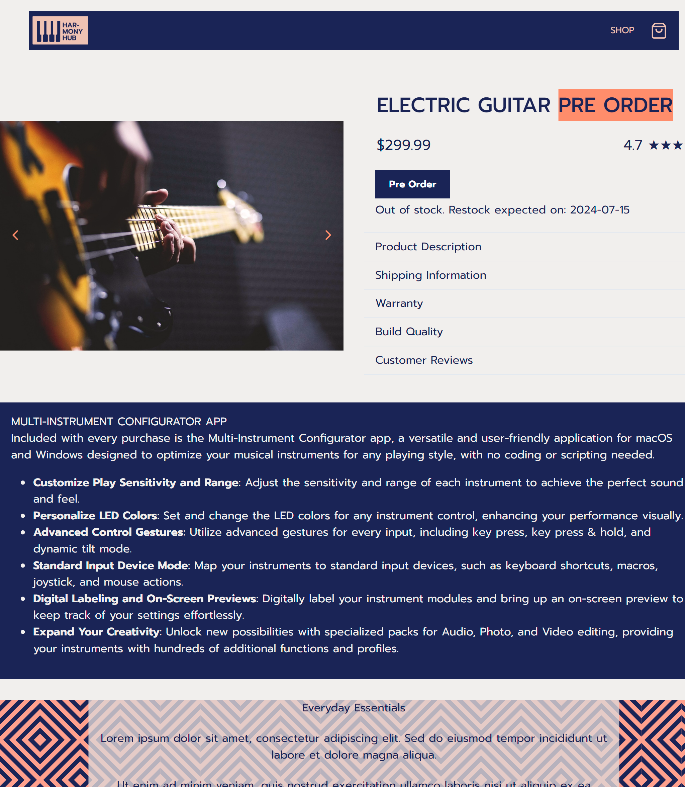
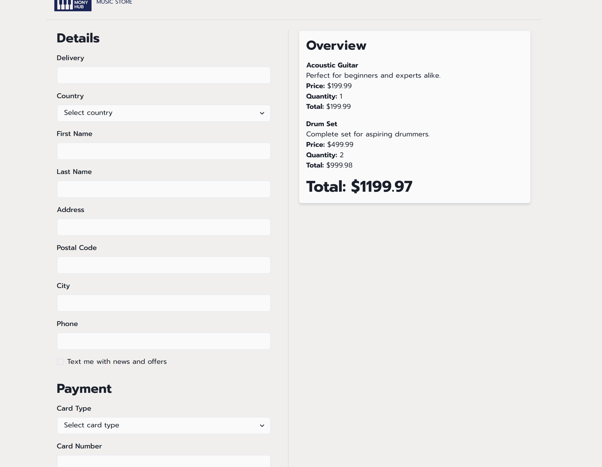

# Harmony Hub Music Store 🎵🎶

## Project Overview

The **Harmony Hub Music Store** is an e-commerce platform designed for purchasing musical instruments and accessories. It showcases a comprehensive understanding of front-end development, offering users a smooth shopping experience. The project includes a full product catalog, detailed product pages, a shopping cart, and an integrated checkout process. Stock updates dynamically on individual item pages.

## Features

- **Product Catalog**: An extensive range of musical instruments and accessories.
- **Product Pages**: Detailed information, stock availability, and real-time updates for each item.
- **Shopping Cart**: Add, preview, and update items before proceeding to checkout.
- **Checkout Process**: Complete a seamless transaction with user-friendly forms.
- **Stock Management**: Items update in real-time based on selections.
- **Routing**: React Router allows smooth navigation between pages without page reloads.
- **State Management**: `useContext` is used to manage the shopping cart across the app.
- **Responsive Design**: Styled with **Chakra UI**, providing a modern, responsive interface across all screen sizes.

## Technologies Used

- **React**
- **JavaScript**
- **React Router**
- **useContext**
- **Chakra UI**
- **HTML**
- **CSS**

## Live Demo

[Check Out the Live Version](https://harmonyhubproject.netlify.app/)

## Repository

[GitHub Repository](https://github.com/claudiooleite/harmony_hub)

## Screenshots

### Home Page

### Product Page

### Checkout Page

